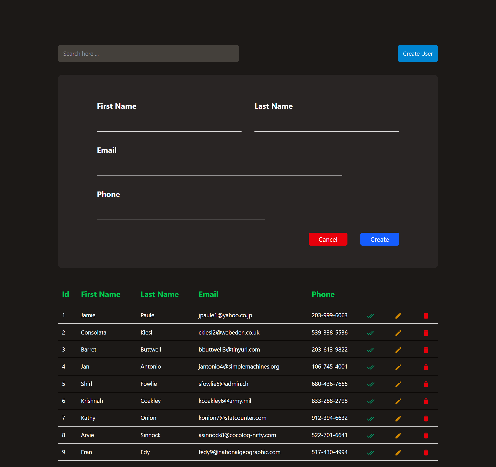
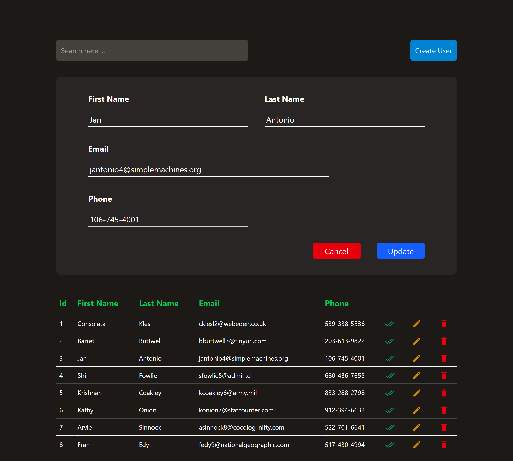
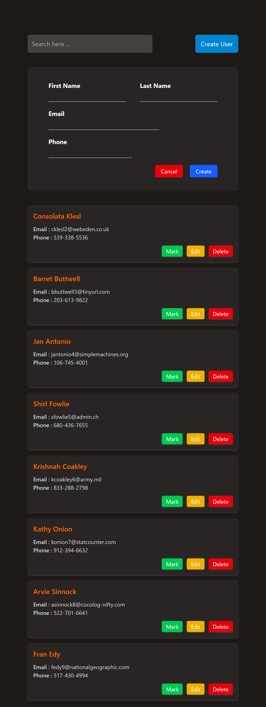
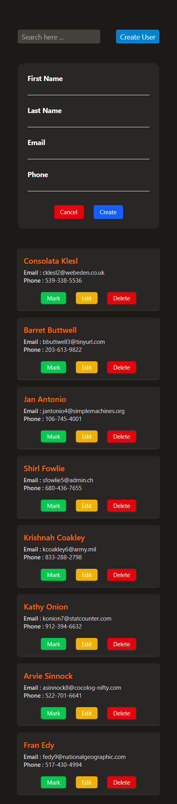

# 🔍 Search App

A simple **React + Vite** application that demonstrates managing and displaying user data using reusable components.
The app includes a table view and a form to create users, making it a good example of basic CRUD-style UI logic in React.

---

## 🚀 Features

* ⚛️ Built with **React** and **Vite**
* 📋 Display data in a table
* ➕ Create users using a form component
* 🧩 Reusable React components
* 🎨 Basic styling with CSS
* ⚡ Fast development environment with Vite

---

## 🛠 Tech Stack

* **React**
* **Vite**
* **JavaScript (ES6+)**
* **CSS**
* **ESLint**

---

## 📁 Project Structure

```
search_app/
├── public/
│   └── vite.svg
├── src/
│   ├── assets/
│   │   └── react.svg
│   ├── components/
│   │   ├── CreateUserForm.jsx
│   │   └── Table.jsx
│   ├── data/
│   │   └── data.jsx
│   ├── App.jsx
│   ├── index.css
│   └── main.jsx
├── index.html
├── package.json
├── vite.config.js
└── eslint.config.js
```

---

## 📦 Installation

1. Clone the repository:

   ```bash
   git clone <your-repo-url>
   ```

2. Navigate to the project folder:

   ```bash
   cd search_app
   ```

3. Install dependencies:

   ```bash
   npm install
   ```

---

## ▶️ Running the App

Start the development server:

```bash
npm run dev
```

Then open your browser and go to:

```
http://localhost:5173
```

---

## 🧠 How It Works

* `CreateUserForm.jsx` handles user input and creation
* `Table.jsx` displays the data in a structured format
* `data.jsx` stores mock or local data used by the app
* `App.jsx` connects everything together

---

## 📸 Screenshots

**Desktop**



**Laptop**



**Tablet**



**Mobile**



---

## 🌐 Live Preview

👉 [View Live App](https://your-live-link-here)

---

## 📄 License

This project is open-source and available under the **MIT License**.

---

## ✨ Author

Built with ❤️ using React and Vite.
